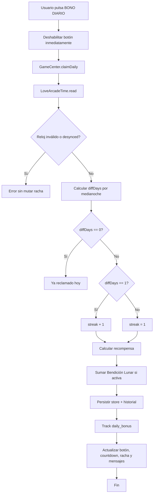

# Sistema de racha diaria — informe técnico y UX

Este documento describe el funcionamiento completo del sistema de **racha diaria** de Love Arcade: persistencia, reglas de negocio, flujo de reclamo, seguridad horaria, economía, UI, analítica, accesibilidad y riesgos actuales.

> **Estado del documento:** informe técnico de profundidad complementario a `docs/DOMAIN.md` §5.
> Las reglas de negocio autoritativas viven en `docs/DOMAIN.md`; este documento añade detalle de
> implementación, UX, accesibilidad y motion que `DOMAIN.md` no cubre por diseño.

## 1. Resumen ejecutivo

La racha diaria es un sistema de retención que recompensa al usuario por volver cada día y reclamar el **Bono Diario**. Técnicamente vive en `js/domain/daily-streak.js`; `js/domain/game-center.js` expone sus métodos mediante `window.GameCenter` y `js/ui/hud-render.js` actualiza el HUD, y se representa en el estado persistido como:

```js
daily: { lastClaim: 0, streak: 0 }
```

El sistema usa **días calendario locales con corte flexible a las 03:00 AM** en lugar de esperar 24 horas exactas. Esto significa que si un usuario reclama antes de dormir y vuelve durante la madrugada, el sistema no avanza el día de racha hasta las 03:00 AM. La recompensa base empieza en **20 monedas**, sube **+5 monedas por día de racha** y se limita a **60 monedas**. Además, puede recibir **+90 monedas** si tiene activa la Bendición Lunar.

A nivel UX, el sistema aparece principalmente en el HUD de inicio con:

- botón `BONO DIARIO`;
- monto próximo o racha actual;
- cuenta regresiva hasta medianoche cuando ya se reclamó;
- barra visual de 7 segmentos;
- mensaje temporal de éxito/error;

## 2. Archivos relacionados

| Archivo | Rol dentro del sistema |
|---|---|
| `js/domain/daily-streak.js` | Reclamo, cálculo de racha, reparación y bonus de Bendición Lunar; depende de tiempo, store e historial, sin manipular el DOM. |
| `js/domain/game-center.js` | Ensambla la API pública `window.GameCenter`, incluida la racha diaria. |
| `js/ui/hud-render.js` | Actualiza el HUD diario, el mensaje de estado y el modal de reparación; se suscribe al store. |
| `js/core/time-sync.js` | Inicializa y mantiene el caché de tiempo de red; expone `window.LoveArcadeTime` para cálculo de día, lectura de caché y próximo reset. `js/app.js` sólo invoca su arranque durante el bootstrap. |
| `js/streak-hub.js` | Adaptador visual del Daily Streak Hub: sincroniza `data-state`, secuencia de reclamo, audio sintetizado, monedas efímeras y haptics opcionales. |
| `index.html` | Estructura del HUD diario, barra de racha y panel de racha en configuración. |
| `styles.css` | Estilos visuales, estados y animaciones del HUD diario. |
| `docs/DOMAIN.md` | Contrato actual de economía, racha y sistema de recompensas. |
| `docs/operations/streak-recovery.md` | Guía operativa canónica con SQL para diagnosticar y restaurar manualmente la racha de un usuario desde Supabase. |

## 3. Modelo de datos y persistencia

### 3.1 Estado principal

El estado se guarda bajo la clave `gamecenter_v6_promos` en `localStorage`. Dentro del store, el sistema de racha usa:

```js
{
  daily: {
    lastClaim: number, // timestamp ms del último reclamo exitoso
    streak: number     // contador de racha vigente
  },
  buffs: {
    moonBlessingExpiry: number // timestamp ms de expiración de Bendición Lunar
  },
  history: Array<{ tipo, cantidad, motivo, fecha }>
}
```

`daily.lastClaim` es la referencia para saber si el usuario ya reclamó hoy y si la racha continúa. `daily.streak` es el valor mostrado en la UI y usado para calcular la recompensa del siguiente reclamo.

### 3.2 Defaults y migración

`migrateState()` inicializa `daily` con `{ lastClaim: 0, streak: 0 }` y `buffs` con `moonBlessingExpiry: 0`. También migra el campo legado `lastDaily` a `daily.lastClaim` y crea una racha inicial de `1` si el valor legado es válido.

### 3.3 Estado público

`GameCenter.getState()` expone una lectura segura que incluye `streak`, pero no entrega el objeto interno completo. Esto lo usan módulos externos como tienda, router o notificaciones para renderizar o sincronizar sin mutar el store directamente.

## 4. Configuración económica

Los parámetros globales están centralizados en `CONFIG`:

```js
dailyReward: 20,
dailyStreakCap: 60,
dailyStreakStep: 5
```

La fórmula de recompensa base es:

```js
baseReward = min(20 + (newStreak - 1) * 5, 60)
```

Tabla base sin Bendición Lunar:

| Racha otorgada | Recompensa base |
|---:|---:|
| 1 | 20 |
| 2 | 25 |
| 3 | 30 |
| 4 | 35 |
| 5 | 40 |
| 6 | 45 |
| 7 | 50 |
| 8 | 55 |
| 9+ | 60 |

Con Bendición Lunar activa, el total suma **+90 monedas**:

```js
totalReward = baseReward + moonBonus
moonBonus = moonActive ? 90 : 0
```

Ejemplos:

| Racha otorgada | Base | Con Bendición Lunar |
|---:|---:|---:|
| 1 | 20 | 110 |
| 5 | 40 | 130 |
| 9+ | 60 | 150 |

## 5. Reglas de racha diaria

El sistema compara **medianoche relativa contra medianoche relativa** con una madrugada flexible de 3 horas:

1. `nowMidnight = LoveArcadeTime.dayStart(now)`, que resta 3 horas antes de normalizar a medianoche local.
2. `lastMidnight = LoveArcadeTime.dayStart(lastClaim)`, aplicando el mismo desfase de 3 horas.
3. `diffDays = Math.round((nowMidnight - lastMidnight) / 86_400_000)`.

Reglas:

| `diffDays` | Resultado |
|---:|---|
| `0` | Ya reclamó hoy. No se entrega recompensa. |
| `1` | La racha continúa. Se incrementa desde la racha actual. |
| `2` | La racha entra en **Recuperación Retroactiva**: puede rescatarse por 500 monedas sin reiniciar. |
| `> 2` | La racha se rompió. Se reinicia a `1`. |
| Sin reclamo previo | Se considera primer reclamo y queda en `1`. |

La racha se incrementa en `+1` cuando `diffDays === 1`.

## 6. Flujo técnico de reclamo

El flujo principal ocurre cuando el usuario pulsa `#btn-daily`:

1. El listener del botón desactiva el botón **sincrónicamente** antes de ejecutar la lógica. Esto evita dobles clics o carreras.
2. Se ejecuta `window.GameCenter.claimDaily()`.
3. `claimDaily()` lee el caché de tiempo con `LoveArcadeTime.read()`.
4. Se bloquea si detecta salto negativo de reloj (`now < lastClaim`).
5. Se bloquea si el último sync marcó `desynced`.
6. Se calcula `diffDays` usando días calendario.
7. Si `diffDays === 0`, devuelve error de “ya reclamado”.
8. Calcula nueva racha y recompensa base.
9. Añade Bendición Lunar si está activa.
10. Suma monedas al store.
11. Si `diffDays === 2`, no muta el store y devuelve `repairRequired` para que la UI abra la confirmación de reparación. En reclamos normales, actualiza `store.daily = { lastClaim: now, streak: newStreak }`.
12. Registra transacción en `history`.
13. Persiste con `saveState()`.
14. Actualiza UI de Bendición Lunar.
15. Dispara analítica `daily_bonus` solo si hubo éxito.
16. Devuelve un objeto `{ success, reward, baseReward, moonBonus, streak, verified, message }`.
17. El listener pinta el mensaje en `#daily-msg` y llama `updateDailyButton()`.

## 7. Seguridad horaria y anti-abuso

### 7.1 Caché de tiempo de red

El sistema desacopla validación de tiempo y reclamo para que el botón sea instantáneo. La sincronización de tiempo corre en segundo plano y guarda un caché en `localStorage` bajo `love_arcade_time_cache`.

El caché contiene:

```js
{
  drift: number,
  desynced: boolean,
  capturedAt: number
}
```

- `drift` es la diferencia entre tiempo de red y `Date.now()`.
- `desynced` se activa si la discrepancia supera 5 minutos.
- `capturedAt` permite saber si el caché sigue fresco.

El TTL del caché es de **4 horas**. Si no hay caché o expiró, `claimDaily()` puede usar el reloj local y marca `verified: false`.

### 7.2 Fuente de tiempo

`_fetchServerDateHeader()` en `js/core/time-sync.js` hace un `HEAD /` y usa el header HTTP `Date` del propio origen. Esto evita depender de APIs de terceros y problemas CORS.

### 7.3 Casos bloqueados

| Caso | Resultado |
|---|---|
| `now < lastClaim` | Bloquea con mensaje de inconsistencia horaria. No toca la racha. |
| Caché `desynced: true` | Bloquea con mensaje de reloj desincronizado. |
| Doble clic rápido | El botón ya está `disabled` antes de llamar a `claimDaily()`. |
| Mismo día calendario | No entrega recompensa y muestra “Ya reclamaste tu bono hoy”. |

### 7.4 Riesgo residual

El reclamo no consulta red en tiempo real. Esto mejora UX, pero si el usuario está sin caché válido y manipula el reloj, el sistema puede caer al reloj local. La documentación del código asume que el sync en background cubre el caso habitual y que el riesgo neto se reduce porque la Bendición Lunar y otras economías también dependen del ecosistema persistido/sincronizado.

## 8. API pública relacionada

### `GameCenter.claimDaily()`

Reclama el bono diario y muta estado si procede.

Retorno de éxito típico:

```js
{
  success: true,
  reward: 110,
  baseReward: 20,
  moonBonus: 90,
  streak: 1,
  verified: true,
  message: '¡+110 monedas! Racha: 1 día'
}
```

Retorno de fallo típico:

```js
{
  success: false,
  verified: true,
  message: '¡Ya reclamaste tu bono hoy! Vuelve mañana.'
}
```

### `GameCenter.canClaimDaily()`

Retorna `true` si ya cambió el día calendario flexible respecto a `daily.lastClaim` usando el mismo caché `love_arcade_time_cache` que `claimDaily()`. Si el caché marca `desynced`, retorna `false` para evitar falsas promesas de UI.

### `GameCenter.getStreakInfo()`

Devuelve:

```js
{
  streak,
  nextReward,
  canClaim,
  repairAvailable,
  repairCost,
  canAffordRepair
}
```

`nextReward` calcula la recompensa base de la siguiente racha prevista y no suma Bendición Lunar; la UI suma esos 90 por separado.

### `GameCenter.getState()`

Expone `streak` como lectura pública para módulos externos.

## 9. UX en la pantalla de inicio

### 9.1 Estructura del Daily Streak Hub

En `index.html`, `#player-hud` conserva una fila de identidad compacta con `#hud-avatar-display`, `#display-nickname` y `#cloud-sync-indicator`. El único control de reclamo es el botón nativo `#btn-daily.streak-hub-cta`; contiene el fuego decorativo `#streak-flame`, el número grande `#streak-count-big`, la etiqueta `#hud-daily-label`, el copy `#streak-hub-copy` con `#hud-daily-cta-text` y el importe `#hud-reward-amount`.

Debajo del botón se mantienen `#streak-days` (siete segmentos) y `#streak-count` (respaldo visualmente oculto para `updateStreakBar()`), `#daily-countdown` con `#countdown-display`, `#daily-msg`, y el contenedor decorativo `#streak-coin-burst`. Esta estructura conserva los IDs que consume la lógica de negocio y permite que toda la zona de fuego, número y CTA sea táctil y operable por teclado.

### 9.2 Estados visuales

`window.StreakHub.refresh()` consulta `GameCenter.getStreakInfo()` y `GameCenter.canClaimDaily()` y escribe el resultado en `#streak-flame[data-state]`. El atributo es la única representación visual adicional del estado; no sustituye ni persiste el estado de `GameCenter`.

| Estado | Condición | Tratamiento |
|---|---|---|
| `locked` | Racha `0` y bono disponible | Fuego atenuado, sin chispas, listo para iniciar la racha. |
| `available` | Bono disponible sin reparación | Fuego intenso, halo y chispas; CTA de reclamo activo. |
| `repair` | `repairAvailable` es verdadero | Fuego ámbar sin chispas; el CTA se presenta como reparación. |
| `claiming` | Reclamo exitoso durante 480 ms | Burst puntual; estado transitorio no persistido. |
| `claimed` | Bono ya reclamado sin reparación | Fuego calmado y countdown visible. |

`updateDailyButton()` conserva la autoridad sobre `disabled`, `data-mode`, el nombre accesible del botón, el texto del CTA y el importe. En modo normal muestra `+total`, donde el total incluye los 90 de Bendición Lunar cuando está activa; tras reclamar muestra `×streak`; en reparación muestra el coste de reparación.

### 9.3 Sincronización y feedback de reclamo

El módulo `js/streak-hub.js` se carga después de `js/domain/daily-streak.js`, `js/ui/hud-render.js` y el bootstrap `js/app.js`. No crea polling: se refresca al cargar el DOM, mediante `HomeView.refresh()` y después de los refrescos ya existentes del HUD. Tras un resultado exitoso, `playClaimSequence(result)` coloca el fuego en `claiming`, llama al audio sintetizado dentro del gesto de usuario y, 480 ms después, restaura el estado final, anima una vez `#streak-count-big` y genera ocho monedas en `#streak-coin-burst` que se eliminan al terminar su animación. Si el reclamo falla, no genera el burst y solo refresca el estado.

El resultado textual continúa en `#daily-msg[role="status"][aria-live="polite"]`, visible durante 3.5 segundos. El fuego y las monedas son decorativos y no emiten anuncios adicionales.

### 9.4 Cuenta regresiva y micro-progreso

`updateCountdownDisplay()` muestra `#daily-countdown` cuando `canClaimDaily()` es falso y actualiza `#countdown-display` por segundo mediante el grupo `countdown` de `window.AppScheduler`. `updateStreakBar()` conserva los siete segmentos de `#streak-days`: los anteriores a la racha reciben `.active`, el siguiente recibe `.today` mientras la racha sea menor de siete, y `#streak-count` conserva el valor textual completo cuando la racha supera siete.

## 10. UX en configuración / tienda

En `index.html` hay una tarjeta “Racha Diaria” dentro del área de configuración/economía. Explica que volver cada día aumenta la recompensa, renderiza `#settings-streak-calendar` y muestra la regla “Cada día de racha aumenta +5 monedas (máx. 60)”.

El render exacto de ese calendario no está en el fragmento principal de racha, pero el estado público (`getState().streak`) está preparado para que otros módulos lo consuman.

## 11. Bendición Lunar y su relación con la racha

La Bendición Lunar no cambia la racha; cambia el valor económico del reclamo diario. Al estar activa:

- el botón diario muestra el total con `+90` incluido;
- `claimDaily()` suma `moonBonus = 90`;
- el historial registra “Bono diario · racha N + Bendición Lunar”;
- la analítica marca `luna: '+90'`.

La Bendición Lunar puede comprarse por 100 monedas durante 7 días y extenderse mediante sus operaciones de economía existentes.

## 13. Analítica y observabilidad

### 13.1 `daily_bonus`

`claimDaily()` dispara `window.GhostAnalytics?.track('daily_bonus', ...)` solo en éxito. Metadatos:

| Campo | Significado |
|---|---|
| `recompensa` | Total entregado. |
| `base` | Recompensa base sin Bendición Lunar. |
| `luna` | `+90` o `no`. |
| `racha` | Racha resultante. |

Esto permite medir engagement diario, uso de Bendición Lunar y distribución de rachas.

## 14. Historial económico

Cada reclamo exitoso registra una transacción:

```js
logTransaction(
  'ingreso',
  totalReward,
  `Bono diario · racha ${newStreak}` + (moonBonus ? ' + Bendición Lunar' : '')
)
```

El historial se limita a las últimas 50 entradas para no inflar `localStorage`.

## 15. Accesibilidad

- `#btn-daily` es un `<button type="button">` nativo, por lo que conserva Tab, Enter y Espacio. `updateDailyButton()` alterna su nombre accesible entre «Reclamar bono diario» y «Reparar racha diaria».
- El botón enlaza `#daily-msg`, `#daily-countdown` y `#streak-hub-copy` mediante `aria-describedby`. `.streak-hub-cta:focus-visible` usa un anillo de foco basado en `--focus-ring-aa`.
- `#streak-flame` y `#streak-coin-burst` son decorativos y usan `aria-hidden="true"`; el fuego además declara `aria-live="off"`. `.streak-hub-number` usa `role="img"` y `StreakHub` actualiza su `aria-label` con la racha actual.
- `#daily-msg` es el único canal de anuncio del resultado: `role="status"` y `aria-live="polite"`. No deben añadirse anuncios duplicados para el burst, chispas o audio.
- El modal de reparación enfoca el botón de confirmación al abrirse y devuelve el foco a `#btn-daily` al cerrarse. El contraste de los números en gradiente debe verificarse visualmente frente al fondo al cambiar tokens de tema.

## 16. Motion y rendimiento UX

El fuego se compone de capas SVG, halo y chispas CSS. Las animaciones repetidas usan `transform` y `opacity`; el halo no anima su `filter: blur()`. `claiming` ejecuta un burst de 480 ms y el reclamo exitoso genera ocho monedas efímeras que se eliminan en `animationend`; el número recibe un bump único. El audio se sintetiza con Web Audio API y la vibración solo se solicita cuando el navegador la permite dentro de la activación de usuario.

Las salvaguardas son parte del contrato del hub: `prefers-reduced-motion: reduce` desactiva las animaciones de fuego, halo, chispas y burst, y acorta la duración de las monedas a 260 ms; `pointer: coarse` reduce el blur del halo a 10 px. Al ocultar la pestaña, el listener existente añade `.motion-paused` a `.player-hud`, con lo que `styles.css` pausa las capas del fuego, el halo y las chispas. `StreakHub.refresh()` no crea timers y reutiliza los puntos de refresco del HUD; el countdown sigue bajo `AppScheduler` y evita escrituras redundantes dentro del mismo segundo.

## 17. Estados de UX cubiertos

| Estado | Cobertura actual |
|---|---|
| Primer usuario sin racha | `lastClaim = 0`, puede reclamar, recompensa inicial `+20`. |
| Bono disponible | Botón habilitado, muestra `+reward`. |
| Bono ya reclamado | Botón deshabilitado, muestra `×streak`, countdown visible. |
| Reclamo exitoso | Mensaje verde, monedas sumadas, UI recalculada. |
| Reclamo repetido mismo día | Mensaje amarillo, no cambia estado. |
| Reloj inconsistente | Mensaje amarillo, no cambia racha. |
| Racha rota | Próximo reclamo reinicia a `1`. |
| Bendición Lunar activa | Suma +90 y cambia textos/estado relacionados. |

## 18. Casos límite importantes

| Caso | Comportamiento |
|---|---|
| Reclamo a las 23:59 y luego a las 00:01 | No avanza prematuramente: ambos caen en el mismo día flexible hasta las 03:00 AM. |
| Más de un día sin reclamar | `diffDays > 1`, racha se reinicia a 1. |
| Racha mayor a 7 | Barra queda llena; contador textual muestra valor real. |
| Caché horario vencido | Reclamo usa reloj local y `verified: false`. |
| Caché horario desincronizado | Reclamo bloqueado. |
| Usuario reclama y clickea varias veces | Botón se deshabilita antes de la mutación. |
## 19. Riesgos técnicos detectados

1. **Dependencia de reloj local cuando no hay caché válido.** Es un trade-off UX/seguridad: permite uso offline o primera visita, pero reduce robustez anti-manipulación.
2. **Comparación por `Math.round`.** Para días normalizados a medianoche normalmente funciona, pero cambios de horario de verano podrían producir diferencias de 23/25 horas. `Math.round` mitiga algunos casos, aunque conviene testear zonas con DST.
3. **UI y validación usan fuentes distintas.** `canClaimDaily()` usa `Date.now()` local; `claimDaily()` usa caché de red si existe. Puede haber un caso donde la UI habilite el botón pero el reclamo lo bloquee por `desynced`.
4. **Accesibilidad de anuncios.** Los mensajes dinámicos no están garantizados para screen readers.
5. **Focus management del modal.** El modal declara semántica, pero no se observa focus trap/restauración explícita.
## 20. Recomendaciones

### Alta prioridad

- Mantener `role="status"` y `aria-live="polite"` en `#daily-msg` cuando se modifique el HUD.
- Añadir texto accesible para racha actual y próximo bono.
- Mantener la regla global `prefers-reduced-motion` para nuevas animaciones de racha o reparación.

### Media prioridad

- Crear tests unitarios para `claimDaily()`, `canClaimDaily()` y `getStreakInfo()` con casos de medianoche, ruptura de racha, Bendición Lunar y reloj desincronizado.
- Ajustar notificaciones para que `next_daily_claim_at` apunte a la próxima medianoche local en vez de `now + 24h`.

### Baja prioridad

- Documentar en comentarios de UI que la barra es semanal/compacta y que el contador textual es la fuente para rachas >7.
- Considerar un estado “offline/no verificado” discreto si el producto necesita mayor transparencia.

## 23. Secuencia resumida



## 24. Conclusión

El sistema de racha diaria está bien integrado con la economía, la UI del HUD, Bendición Lunar, analítica y notificaciones. Su decisión UX más importante es usar **días calendario** y no ventanas rígidas de 24 horas, lo cual reduce frustración y hace que el hábito diario sea más natural. La arquitectura prioriza respuesta instantánea con validación horaria en background; esto favorece la experiencia, aunque deja un riesgo residual cuando no hay caché de tiempo válido.

Las mejoras más valiosas no requieren reescritura: reforzar accesibilidad de mensajes dinámicos y modal, añadir pruebas de fechas y alinear notificaciones con medianoche local.


## 22. Actualización v12 — Madrugada Flexible y Recuperación Retroactiva

- El corte de racha diaria se desplaza a las **03:00 AM** mediante `DAILY_DAY_OFFSET_MS`. Antes de calcular el día calendario, el motor resta 3 horas al timestamp evaluado; así, un reclamo a las 01:30 AM sigue perteneciendo al día anterior.
- `canClaimDaily()`, `getStreakInfo()`, `claimDaily()` y el countdown del HUD comparten la misma semántica de corte flexible y el mismo caché horario, evitando discrepancias entre UI y validación.
- Cuando `diffDays === 2`, `claimDaily()` no reinicia la racha. Devuelve `repairRequired`, el HUD cambia a **REPARAR RACHA** y `repairDailyStreak()` permite conservar la racha vigente a cambio de **500 monedas**.
- Si el usuario no tiene saldo suficiente, el botón queda deshabilitado y `#daily-msg` muestra “Consigue las monedas que faltan jugando en el Arcade.” sin mutar `localStorage`.
- `#daily-msg` ahora anuncia cambios con `role="status"` y `aria-live="polite"`; los pulsos de botón/racha y los modales respetan `prefers-reduced-motion`.
