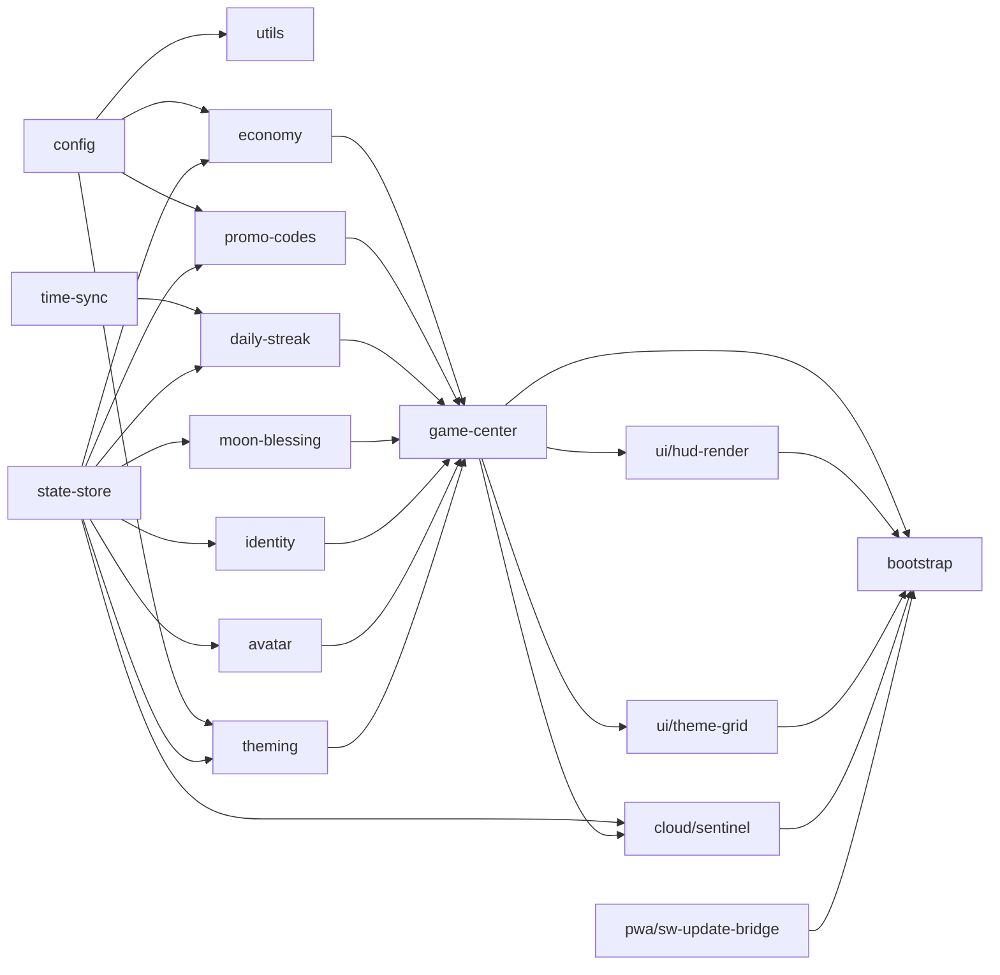

# Auditoría y plan de modularización de `js/app.js`

## 1. Resumen ejecutivo

`js/app.js` es actualmente un **"God file"**: concentra configuración estática, lógica de dominio (economía, códigos promo, racha diaria, Bendición Lunar, identidad, avatar, temas), persistencia y migración de estado, sincronización de tiempo de red, un cliente de Web Worker, renderizado de UI (HUD, coin display, grid de temas), micro-interacciones de accesibilidad, todo el subsistema de sincronización cloud (Sentinel) —incluyendo un *monkey-patch* global de `localStorage.setItem/removeItem`— y el puente de actualización del Service Worker.

El repositorio **no tiene bundler ni `package.json`**: todo se sirve como scripts clásicos (`<script>`) en orden estricto, comunicándose por `window.*`. Esto es una restricción arquitectónica dura, no un detalle menor: el propio código documenta que el bloque de inicialización síncrona de `app.js` debe ejecutarse **antes del primer paint** para evitar parpadeo visual ("Zero-Flicker Initiative v9.3"). Cualquier propuesta de modularización que use `type="module"` (diferido por defecto) reintroduciría ese bug. Por eso la propuesta mantiene el patrón actual (scripts clásicos + namespaces `window.*`), y usa como eje de corte la frontera real que ya existe en el código: **camino crítico síncrono pre-paint** vs. **todo lo demás**.

No se modifica ningún comportamiento en esta fase. Se entrega diagnóstico, arquitectura objetivo, plan de migración incremental y 18 tickets ejecutables por otro agente.

## 2. Archivos inspeccionados y limitaciones

Inspeccionados íntegramente: `js/app.js`, `js/shop-logic.js`, `js/spa-router.js`, `js/streak-hub.js`, `js/lifecycle-scheduler.js`, `js/analytics.js`, `js/backup-engine.js`, `js/sync-worker.js`, `js/supabase-loader.js`, `api/client-config.js`, `api/report.js`, `api/telemetry.js`, `index.html`, `styles.css`, `sw.js`, `vercel.json`, `manifest.webmanifest`, `data/shop.json`, todo `docs/*`, `tests/*.mjs`, `README.md`, `.agents/skills/*`.

Limitaciones:
- No hay `package.json`, linter, bundler ni test runner declarado; no puedo ejecutar nada, solo lectura estática. Las referencias a "línea X" no están disponibles (no hay numeración de línea persistente en el visor); cito por nombre de función/sección, que es estable y buscable.
- No tengo acceso a `js/event-logic.js` (referenciado por comentarios en `app.js` — Gachapón/Cacería de Tesoros) ni a los ficheros de `games/*`; el análisis de esos consumidores de `window.GameCenter` es indirecto, vía lo que documenta `docs/INTEGRATION.md`.
- No puedo verificar comportamiento en runtime (flicker real, race conditions de Sentinel); las afirmaciones sobre timing se basan en los comentarios explícitos del propio código y en el orden de `<script>` en `index.html`.

## 3. Diagnóstico arquitectónico

### 3.1 SRP / cohesión — `js/app.js` mezcla ≥10 responsabilidades no relacionadas
Evidencia (por sección dentro del archivo): `CONFIG/ECONOMY/THEMES/PROMO_CODES_HASHED` (datos estáticos) → utilidades genéricas (`sha256`, `debounce`) → subsistema de tiempo de red (`_readTimeCache`, `_fetchServerDateHeader`, `_syncTimeBackground`) → cliente de Web Worker (`workerTask`) → migración/persistencia (`migrateState`, `saveState`, `emergencyCleanup`) → animación de contador (`animateValue`) → historial (`logTransaction`) → subsistema de avatar (compresión de imagen + subida a Supabase Storage) → `window.GameCenter` (API de dominio completa) → renderizado de HUD/temas → orquestación de `DOMContentLoaded` (incluye lógica de negocio del botón diario) → IIFE completa de Cloud Sync (Sentinel) → IIFE del banner de actualización del SW.
**Impacto:** imposible leer, testear o revisar en aislamiento cualquiera de estas piezas; cualquier cambio en, p. ej., la fórmula de racha diaria obliga a cargar mentalmente todo el archivo.

### 3.2 Acoplamiento oculto vía variable de módulo `store`
`let store = migrateState({})` es una variable de cierre compartida por ~40 funciones. No hay getter/setter explícito: cualquier función lee y reasigna `store` libremente (incluida la IIFE de Sentinel, que hace `store = migrateState(data)` dentro de `_applySnapshot`/`_rehydrateHubStoreFromDisk`). **Esto es el principal obstáculo técnico para cualquier división en archivos**, no un detalle estético: sin un accessor explícito, dividir en módulos obliga a decidir *quién posee* `store`.

### 3.3 Sentinel (`SentinelCloudSync`) rompe el encapsulamiento del store
Sentinel accede directamente a `store`, `saveState`, `migrateState`, `CONFIG.stateKey` y `_isBase64Avatar` — funciones/variables privadas de `app.js`, no expuestas como API. Además **monkey-patchea `localStorage.setItem`/`removeItem`** a nivel global. Esto es un efecto secundario transversal de gran alcance: cualquier módulo del hub *o de los minijuegos* (mismo origen) que escriba una clave vigilada (`LUMINA_bestScore`, `dodger_highscore`, etc.) dispara sincronización cloud sin saberlo. `docs/INTEGRATION.md` §8-10 no documenta este contrato para integradores de minijuegos — es una omisión documental real, no solo un problema de código.

### 3.4 UI mezclada con lógica de dominio y de persistencia
- `saveState()` (persistencia) llama directamente a `_scheduleUIUpdate()` y `_scheduleCloudSync()` — la capa de storage conoce y orquesta la capa de UI y la de red.
- `checkStorageSize()` (persistencia) crea y anima un nodo `<div class="toast">` directamente (`_showStorageToast`).
- `claimDaily()` (dominio) llama a `updateMoonBlessingUI()` (DOM) dentro de la función de negocio.
- El listener de `#btn-daily` en `DOMContentLoaded` contiene lógica de negocio real (decide `repair` vs `claim`, interpreta `result.repairRequired`) mezclada con manipulación de DOM — no es solo "event wiring".

### 3.5 Testabilidad: cobertura real casi nula sobre lógica de dinero
Los únicos tests existentes (`tests/*.mjs`) son *static QA*: comparan el código fuente contra expresiones regulares (`appSource.match(/const THEMES = .../)`) o, en el mejor caso (`daily-streak-hub-qa.mjs`), ejecutan `js/streak-hub.js` en un `vm` con mocks. **No existe ningún test que ejecute realmente** `claimDaily()`, `buyItem()`, `redeemPromoCode()` o `repairDailyStreak()` con distintos escenarios (racha rota, reloj desincronizado, saldo insuficiente, código duplicado). Es la lógica con mayor riesgo económico del proyecto y la que menos cobertura tiene — consecuencia directa de que está enterrada en un archivo monolítico difícil de cargar en aislamiento.

### 3.6 Restricción dura de timing (zero-flicker) no debe romperse
El comentario "v9.3 Zero-Flicker Initiative" documenta explícitamente por qué `app.js` corre como script clásico bloqueante al final del `<body>`, antes del primer paint: aplica tema, saldo, botón diario y avatar sobre el DOM oculto (`opacity:0`) antes de que el navegador pinte. **Cualquier propuesta que difiera esta ejecución (ES modules, `defer`, carga asíncrona) reintroduce los tres bugs que el propio código dice haber resuelto** (theme flash, coin jitter, state sync gap). Esto descarta la opción de convertir el proyecto a ES modules como parte de esta modularización.

### 3.7 Superficie pública ya razonablemente estable (buena noticia)
`index.html` y `js/shop-logic.js` **no acceden a funciones privadas de `app.js`**: solo consumen `window.GameCenter`, `window.THEMES`, `window.CONFIG`, `window.ECONOMY`, `window.debounce`, `window.formatCoinsNavbar`, `window.AppScheduler`, `window.revealUI`. Esto reduce el riesgo de romper consumidores externos si se preserva ese contrato exacto durante la migración.

### 3.8 Acoplamiento a artefactos de despliegue (no solo a código)
Tres superficies fuera de `js/` dependen del nombre/contenido exacto de `js/app.js`:
- `sw.js` → `APP_SHELL_FILES` precachea `'/js/app.js'` explícitamente (`CACHE_VERSION` debe subir si cambia contenido/ficheros).
- `index.html` → orden estricto de `<script>` documentado en un bloque de comentarios.
- `tests/player-hud-static-qa.mjs`, `tests/daily-streak-hub-qa.mjs`, `tests/interactive-haptics-static-qa.mjs` → leen `js/app.js` como texto y aplican regex sobre su contenido (p. ej. buscan `const THEMES = {...}` y `hud.classList.toggle('motion-paused', ...)` dentro de `appSource`).

Ningún ticket de este plan puede tratarse como "solo mover código JS": todos tienen efectos en despliegue/documentación/tests.

## 4. Arquitectura propuesta

Se mantiene el patrón actual (scripts clásicos + `window.*`, sin bundler), con el corte principal entre **crítico-síncrono** y **resto**.

```
js/
  core/
    config.js          → window.CONFIG, window.ECONOMY, window.THEMES (+ LEGACY_THEME_FALLBACK interno)
    utils.js            → window.debounce (se mantiene el nombre por compat con shop-logic.js), 
                           window.LoveArcadeUtils = { sha256, canUseVibration }
    time-sync.js         → window.LoveArcadeTime = { read, scheduleSync, dayDiff, dayStart, nextResetTime }
    state-store.js       → window.LoveArcadeStore = { getStore, replaceStore, save, migrate, subscribe }
    sync-worker-client.js→ window.workerTask (nombre preservado: backup-engine.js ya depende de él)
  domain/
    history.js           → logTransaction / getHistory (integrado en economy.js o archivo propio pequeño)
    economy.js            → buyItem, spendCoins, addCoins, balance/inventory
    promo-codes.js         → redeemPromoCode (+ tabla hasheada, vía config.js)
    daily-streak.js         → claimDaily, canClaimDaily, getStreakInfo, repairDailyStreak
    moon-blessing.js         → buyMoonBlessing, extendMoonBlessingDays, getMoonBlessingStatus
    identity.js               → setIdentity/getIdentity/hasIdentity (dato puro, sin DOM)
    avatar.js                  → compresión + guardado local/cloud del avatar
    theming.js                  → deriveThemeRoles, applyTheme, getTheme/setTheme
    game-center.js                → ensambla window.GameCenter delegando en los módulos anteriores
  ui/
    coin-display.js       → animateValue, formatCoinsNavbar
    theme-grid.js           → renderThemeGrid + su listener de click
    hud-render.js             → updateUI, applyAvatar, applyIdentity(DOM), updateDailyButton,
                                 updateMoonBlessingUI, showDailyRepairModal, revealUI
    micro-interactions.js       → initInteractiveMicroFX, initLoadingStateObserver
  cloud/
    sentinel.js            → IIFE actual, reubicada, adaptada a state-store.js (sin re-descomponer aún)
  pwa/
    sw-update-bridge.js       → IIFE del banner de actualización
  bootstrap/
    app.js (antes monolito)     → SOLO: orden de invocación del boot síncrono pre-paint +
                                    registro de listeners de DOMContentLoaded (delega la lógica real
                                    a los módulos de dominio/ui, no la contiene)
```

**Regla de dependencias permitidas:** `core/*` no depende de nada más que `core/*`. `domain/*` puede depender de `core/*` pero no de `ui/*` ni `cloud/*`. `ui/*` puede depender de `core/*` y `domain/*` (vía `window.GameCenter`), nunca al revés. `cloud/*` depende de `core/state-store.js` a través de una API explícita (no de variables internas). `bootstrap/app.js` es el único que puede depender de todo, porque es el orquestador.



### Alternativas evaluadas
1. **ES Modules (`type="module"`)** — descartada para el camino crítico por el conflicto documentado con zero-flicker (§3.6); podría considerarse *solo* para `cloud/sentinel.js` y `pwa/sw-update-bridge.js`, que no son pre-paint, pero mezclar módulos clásicos y ES modules en el mismo proyecto sin bundler añade complejidad de mantenimiento (dos convenciones) para un beneficio marginal. **Se descarta también ahí**, por consistencia con el resto de `js/*` (todo IIFE+`window`).
2. **Introducir un bundler (Vite/esbuild)** — resolvería el problema de raíz, pero es un cambio de infraestructura de build que contradice explícitamente el estado actual documentado ("el repositorio no incluye `package.json` ni scripts npm", `README.md`) y excede el alcance de "modularizar sin romper comportamiento". **Queda fuera de alcance; se anota como decisión pendiente de confirmación humana**, no como parte de este plan.
3. **Dividir solo por tamaño de archivo (mecánico, sin rediseño)** — más rápido pero no resuelve el acoplamiento a `store` ni el mezclado UI/dominio/persistencia; se rechaza porque el propio encargo pide una modularización razonada, no un split mecánico.

## 5. Plan de migración y de validación

### Migración (incremental, cada paso es revertible y verificable por separado)
0. **Congelar comportamiento**: checklist de QA manual (Ticket-001) antes de tocar nada.
1. Extraer piezas puras sin dependencia de `store`: `config.js`, `utils.js` (Ticket-002, 003).
2. Extraer `time-sync.js` (Ticket-004) — depende solo de `Date.now()`.
3. Introducir el *accessor* de `store` **dentro del propio `app.js` sin mover archivos todavía** (Ticket-005) — aísla el riesgo del cambio de patrón de acceso al estado del riesgo de reorganizar archivos.
4. Mover físicamente `state-store.js` (Ticket-006).
5. Extraer módulos de dominio, del más simple/aislado al más crítico: `history`+`economy` → `promo-codes` → `moon-blessing`+`identity` → `daily-streak` (con QA reforzada) → `avatar` → `theming` (Tickets 007–012).
6. Extraer UI: `coin-display`, `theme-grid`, `hud-render`, `micro-interactions` (Tickets 012–014).
7. Extraer `pwa/sw-update-bridge.js` (bajo riesgo, se puede adelantar) (Ticket-014).
8. Reubicar `cloud/sentinel.js` como movimiento de archivo + adaptación a la API de `state-store.js` (sin descomponerlo internamente en esta fase) (Ticket-015).
9. Reducir `app.js` a orquestador de arranque; actualizar `index.html`, `sw.js` (precache + `CACHE_VERSION`) (Ticket-016).
10. Actualizar documentación (Ticket-017) y tests/regex + añadir tests reales de dominio (Ticket-018).

### Validación
No existen scripts de `lint`/`typecheck`/`build` en el repo (confirmado en `README.md`); no se inventan. Validación disponible:
- `node tests/shop-catalog-static-qa.mjs`, `node tests/player-hud-static-qa.mjs`, `node tests/daily-streak-hub-qa.mjs`, `node tests/interactive-haptics-static-qa.mjs`, `node tests/documentation-static-qa.mjs` — ejecutar tras cada ticket que toque los archivos que inspeccionan.
- QA manual siguiendo el checklist del Ticket-001, en cada ticket de extracción de dominio/UI.
- Verificación visual explícita de ausencia de flicker (theme flash / coin jitter) tras cualquier ticket que reordene `<script>` en `index.html`.

## 6. Tickets

```
# TICKET-001: Checklist de regresión manual (línea base pre-migración)
**Objetivo** Establecer y ejecutar una vez un checklist manual que documente el comportamiento actual como referencia, dado que no existen tests funcionales de app.js.
**Contexto** app.js no tiene cobertura de test real (§3.5); sin línea base, no se puede confirmar preservación de comportamiento en los tickets siguientes.
**Alcance** Documento de checklist + una ejecución manual registrada.
**Fuera de alcance** Automatización de estos casos (eso es Ticket-018).
**Archivos involucrados** Nuevo: docs/qa/pre-migration-checklist.md
**Implementación (pasos)**
1. Listar escenarios: primer load sin parpadeo, cambio de tema, claim diario (streak+1, reinicio, reparación por 500), redeem promo (válido/duplicado/inválido), compra con/sin oferta y cashback, Bendición Lunar (compra/extensión), subida de avatar local y con sesión cloud, edición de identidad, export/import de backup, login cloud + merge Last-Write-Wins, banner de actualización SW, carga offline.
2. Ejecutar cada uno en el estado actual del repo y registrar el resultado esperado.
**Requisitos técnicos** Ninguno especial; servir con `npx serve .` o `python3 -m http.server`.
**Criterios de aceptación**
- [ ] Checklist documentado con pasos reproducibles
- [ ] Resultado esperado registrado para cada escenario
**Validación** Ejecución manual, sin comando automatizado disponible.
**Riesgos** Ninguno (solo documentación).
**Dependencias** Ninguna.
**Documentación a actualizar** Nuevo archivo únicamente.
**Resultado esperado** Línea base contra la que comparar cada ticket posterior.
```

```
# TICKET-002: Extraer js/core/config.js
**Objetivo** Aislar CONFIG, ECONOMY, THEMES, PROMO_CODES_HASHED y LEGACY_THEME_FALLBACK en un archivo sin dependencias de store/DOM.
**Contexto** Son datos estáticos ya expuestos como window.CONFIG/window.ECONOMY/window.THEMES; no dependen de store.
**Alcance** Mover literalmente el bloque de configuración; preservar exactamente los mismos nombres globales.
**Fuera de alcance** Cambiar valores, añadir validación de esquema.
**Archivos involucrados** Nuevo: js/core/config.js. Editar: js/app.js (eliminar bloque), index.html (nuevo <script> antes de app.js), sw.js (APP_SHELL_FILES + CACHE_VERSION).
**Implementación (pasos)**
1. Crear js/core/config.js con el IIFE que define y expone window.CONFIG, window.ECONOMY, window.THEMES; conservar LEGACY_THEME_FALLBACK como variable interna del módulo si solo se usa en migrateState (o exponerla si state-store.js la necesita — confirmar en Ticket-006).
2. Insertar <script src="js/core/config.js"> en index.html inmediatamente antes de js/app.js.
3. Añadir '/js/core/config.js' a APP_SHELL_FILES en sw.js y subir CACHE_VERSION.
**Requisitos técnicos** Mantener window.THEMES con las 25 claves exactas (validado por tests/player-hud-static-qa.mjs).
**Criterios de aceptación**
- [ ] window.CONFIG/ECONOMY/THEMES idénticos en runtime antes/después
- [ ] tests/player-hud-static-qa.mjs sigue pasando (ajustar su lectura de fuente si es necesario, ver Ticket-018)
**Validación** node tests/player-hud-static-qa.mjs; checklist Ticket-001 (tema y precios).
**Riesgos** Bajo. Orden de <script> incorrecto rompería shop-logic.js (lee window.ECONOMY/CONFIG).
**Dependencias** Ninguna.
**Documentación a actualizar** docs/ARCHITECTURE.md §3, docs/ECONOMIA.md (referencias de ubicación), docs/DOMAIN.md.
**Resultado esperado** config.js autónomo, app.js reducido en ese bloque.
```

```
# TICKET-003: Extraer js/core/utils.js
**Objetivo** Aislar sha256, debounce y _canUseVibration.
**Contexto** Utilidades genéricas sin dependencia de store; window.debounce ya es consumido por shop-logic.js.
**Alcance** Mover funciones preservando window.debounce con ese nombre exacto.
**Fuera de alcance** Cambiar la firma de debounce/sha256.
**Archivos involucrados** Nuevo: js/core/utils.js. Editar: js/app.js, index.html, sw.js.
**Implementación (pasos)**
1. Crear js/core/utils.js exponiendo window.debounce (compat) y window.LoveArcadeUtils = { sha256, canUseVibration }.
2. Insertar <script> antes de js/app.js (después de config.js).
3. Actualizar precache en sw.js.
**Requisitos técnicos** Ninguno.
**Criterios de aceptación**
- [ ] window.debounce sigue funcionando igual en shop-logic.js
- [ ] promo-codes (aún en app.js en este punto) sigue usando sha256 correctamente
**Validación** node tests/interactive-haptics-static-qa.mjs (verifica _canUseVibration); checklist Ticket-001 (redeem código, tap háptico Android).
**Riesgos** Bajo.
**Dependencias** Ticket-002 (orden de scripts).
**Documentación a actualizar** docs/ARCHITECTURE.md §3.
**Resultado esperado** utils.js autónomo.
```

```
# TICKET-004: Extraer js/core/time-sync.js
**Objetivo** Aislar el subsistema de caché/sincronización de tiempo de red.
**Contexto** _readTimeCache/_writeTimeCache/_fetchServerDateHeader/_syncTimeBackground/_scheduleTimeSync/_getDailyDayStart/_getDailyDiffDays/_getNextDailyResetTime no dependen de store, solo de localStorage y fetch('/').
**Alcance** Mover el bloque completo; exponer window.LoveArcadeTime con API explícita en vez de funciones privadas por cierre.
**Fuera de alcance** Cambiar CLOCK_SKEW_LIMIT, TIME_CACHE_TTL u otros valores.
**Archivos involucrados** Nuevo: js/core/time-sync.js. Editar: js/app.js (llamadas a estas funciones deben pasar a window.LoveArcadeTime.*), index.html, sw.js.
**Implementación (pasos)**
1. Crear archivo con la API: read(), scheduleSync(delay), dayDiff(now,last), dayStart(ts), nextResetTime(now).
2. Reemplazar en app.js todas las llamadas internas (claimDaily, canClaimDaily, getStreakInfo, repairDailyStreak, updateCountdownDisplay en index.html vía GameCenter.getNextDailyResetTime) por la nueva API.
3. index.html usa GameCenter.getNextDailyResetTime — no debe cambiar (sigue siendo público).
**Requisitos técnicos** Preservar exactamente la lógica de _getDailyDayStart (offset 3h) — es crítica para docs/sistema-racha-diaria.md.
**Criterios de aceptación**
- [ ] Countdown del HUD sigue funcionando igual (medianoche flexible 03:00)
- [ ] claimDaily sigue bloqueando por desynced/salto negativo
**Validación** checklist Ticket-001 (claim en distintos horarios simulados cambiando el reloj del sistema/dev tools).
**Riesgos** Medio — es lógica horaria sensible; error de offset rompe la racha diaria de usuarios reales.
**Dependencias** Ticket-002, 003.
**Documentación a actualizar** docs/sistema-racha-diaria.md (ubicación del código), docs/DOMAIN.md §5.
**Resultado esperado** time-sync.js autónomo y testeable con Date mockeado.
```

```
# TICKET-005: Introducir accessor de store dentro de app.js (sin mover archivos)
**Objetivo** Reemplazar el acceso directo a la variable `store` por un objeto accessor (getStore/replaceStore/subscribe), manteniendo todo el código en app.js.
**Contexto** §3.2 — es el seam central; hacerlo antes de mover archivos aísla el riesgo de "cambiar cómo se accede al estado" del riesgo de "reorganizar archivos".
**Alcance** Todas las funciones de app.js y la IIFE de Sentinel deben leer/escribir vía el accessor en vez de la variable `store` directamente.
**Fuera de alcance** Mover código a otros archivos.
**Archivos involucrados** js/app.js únicamente.
**Implementación (pasos)**
1. Definir internamente `const StateStore = (function(){ let _store = migrateState({}); const listeners = []; return { get: () => _store, replace: (next) => { _store = next; listeners.forEach(l=>l(_store)); }, subscribe: (fn) => listeners.push(fn) }; })();`
2. Reemplazar cada lectura/escritura de `store` (incluida la reasignación `store = migrateState(...)` dentro de Sentinel) por `StateStore.get()`/`StateStore.replace(...)`.
3. saveState() deja de llamar directamente a _scheduleUIUpdate/_scheduleCloudSync; en su lugar hace StateStore-level notify y dos listeners (UI, cloud) se suscriben una vez al arrancar. Esto desacopla persistencia de UI/red (§3.4) sin mover archivos aún.
**Requisitos técnicos** No cambiar el orden de efectos observables (UI y cloud sync deben seguir disparándose en el mismo momento relativo que hoy).
**Criterios de aceptación**
- [ ] Ninguna función referencia la variable `store` directamente; todas usan StateStore
- [ ] Comportamiento idéntico según checklist Ticket-001, incluido export/import y cloud sync
**Validación** Checklist Ticket-001 completo (es el ticket de mayor riesgo funcional). node tests/daily-streak-hub-qa.mjs.
**Riesgos** Alto — toca el corazón de la persistencia y la sincronización cloud simultáneamente.
**Dependencias** Ticket-004.
**Documentación a actualizar** Ninguna todavía (cambio interno, sin mover archivos).
**Resultado esperado** app.js sigue siendo un solo archivo pero con una frontera interna clara para el store.
```

```
# TICKET-006: Extraer js/core/state-store.js
**Objetivo** Mover físicamente StateStore, migrateState, saveState, checkStorageSize, emergencyCleanup, trimGameProgress y constantes de cuota a su propio archivo.
**Contexto** Consecuencia directa de Ticket-005; ahora que el acceso está encapsulado, el movimiento de archivo es mecánico.
**Alcance** Exponer window.LoveArcadeStore = { getStore, replaceStore, save, migrate, subscribe }. saveState debe seguir aceptando { immediateCloudSync }.
**Fuera de alcance** Cambiar la lógica de emergencyCleanup/quota.
**Archivos involucrados** Nuevo: js/core/state-store.js. Editar: js/app.js, index.html, sw.js.
**Implementación (pasos)**
1. Mover el bloque completo (incluye KB, AVATAR_MAX_LOCAL_KB, AVATAR_CLEANUP_KB, STORE_WARNING_KB, _isBase64Avatar, _trackAvatarStorageFallback si solo lo usa avatar — evaluar mover a avatar.js en Ticket-011 en su lugar).
2. saveState debe notificar vía callbacks registrados por hud-render.js y sentinel.js (Ticket-013/015), no llamarlos directamente por nombre.
3. Actualizar <script> order e index.html + sw.js precache.
**Requisitos técnicos** _showStorageToast permanece temporalmente en app.js o se mueve a ui/hud-render.js si ese ticket ya existe; documentar la decisión tomada.
**Criterios de aceptación**
- [ ] Quota exceeded / emergencyCleanup se comporta igual (probar forzando localStorage lleno)
- [ ] Export/import de backup sigue funcionando (backup-engine.js llama a window.workerTask, no a state-store directamente — confirmar que no se rompió)
**Validación** Checklist Ticket-001 (export/import, avatar grande).
**Riesgos** Medio.
**Dependencias** Ticket-005.
**Documentación a actualizar** docs/ARCHITECTURE.md §3-4, docs/DOMAIN.md §1.
**Resultado esperado** state-store.js autónomo; app.js ya no contiene la variable store.
```

```
# TICKET-007: Extraer js/domain/history.js y js/domain/economy.js
**Objetivo** Aislar logTransaction/getHistory y buyItem/spendCoins/addCoins/getBalance/getInventory/getBoughtCount/getDownloadUrl/getRedeemedCount.
**Contexto** Dependen de state-store.js (ya extraído) y de history.js entre sí.
**Alcance** Exponer funciones internamente; el ensamblado final en window.GameCenter ocurre en game-center.js (Ticket-012 o un ticket dedicado si se prefiere separarlo).
**Fuera de alcance** Cambiar fórmulas de precio/cashback (documentadas en docs/DOMAIN.md §2, son contrato).
**Archivos involucrados** Nuevos: js/domain/history.js, js/domain/economy.js. Editar: js/app.js, index.html, sw.js.
**Implementación (pasos)**
1. history.js: logTransaction(tipo,cantidad,motivo) usando LoveArcadeStore; getHistory().
2. economy.js: portar buyItem/spendCoins/addCoins/getBalance/getInventory/getBoughtCount/getDownloadUrl/getRedeemedCount, dependiendo de window.ECONOMY (config.js) y history.js.
3. Mantener el track de GhostAnalytics para insufficient_funds exactamente igual (shop-logic.js y streak/daily lo esperan).
**Requisitos técnicos** Ninguno nuevo.
**Criterios de aceptación**
- [ ] Compra con/sin oferta y cashback idéntica (verificar Math.floor en ambos cálculos)
- [ ] Historial sigue limitado a 50 entradas
**Validación** Checklist Ticket-001 (compra, historial). node tests/shop-catalog-static-qa.mjs.
**Riesgos** Medio — es dinero real del usuario (moneda del juego).
**Dependencias** Ticket-006.
**Documentación a actualizar** docs/DOMAIN.md §2 y §8 (ubicación), docs/ECONOMIA.md.
**Resultado esperado** economy.js e history.js autónomos y unit-testeables.
```

```
# TICKET-008: Extraer js/domain/promo-codes.js
**Objetivo** Aislar redeemPromoCode y PROMO_CODES_HASHED (mover la tabla desde config.js si se decidió dejarla ahí en Ticket-002, o directamente aquí).
**Contexto** Depende de utils.sha256, state-store, history.js.
**Alcance** Preservar exactamente la comparación por hash y el rechazo de duplicados.
**Fuera de alcance** Cambiar/añadir códigos promocionales.
**Archivos involucrados** Nuevo: js/domain/promo-codes.js. Editar: js/app.js, index.html, sw.js, posiblemente js/core/config.js (si la tabla se relocaliza aquí, documentarlo).
**Implementación (pasos)**
1. Decidir explícitamente dónde vive PROMO_CODES_HASHED (recomendado: aquí, no en config.js, porque es dato de dominio sensible, no configuración de UI) — **requiere confirmación humana** si se prefiere mantenerla en config.js por razones de ofuscación conjunta.
2. Portar redeemPromoCode íntegro.
**Requisitos técnicos** No se reduce el "riesgo" de exposición client-side (§ nota de seguridad); no confundir con una mejora de seguridad.
**Criterios de aceptación**
- [ ] Redención válida/duplicada/inválida idéntica a hoy
**Validación** Checklist Ticket-001 (redeem). 
**Riesgos** Bajo-Medio.
**Dependencias** Ticket-006, 007.
**Documentación a actualizar** docs/DOMAIN.md §4.
**Resultado esperado** promo-codes.js autónomo.
```

```
# TICKET-009: Extraer js/domain/moon-blessing.js y js/domain/identity.js
**Objetivo** Aislar buyMoonBlessing/extendMoonBlessingDays/getMoonBlessingStatus y setIdentity/getIdentity/hasIdentity (dato puro, sin la escritura DOM de applyIdentity, que va a ui/hud-render.js en Ticket-013).
**Contexto** Ambos son módulos pequeños y de bajo acoplamiento entre sí.
**Alcance** identity.js expone solo lectura/escritura de store; la sincronización visual (nickname en el HUD) se mueve, no se duplica.
**Fuera de alcance** Cambiar duración/costo de Bendición Lunar.
**Archivos involucrados** Nuevos: js/domain/moon-blessing.js, js/domain/identity.js. Editar: js/app.js, index.html, sw.js.
**Implementación (pasos)**
1. Portar moon-blessing.js íntegro (depende de state-store).
2. Portar identity.js sin la función applyIdentity (queda pendiente de mover en Ticket-013; en este ticket, setIdentity puede seguir llamando temporalmente a una función global applyIdentity hasta que exista, documentar el estado transitorio).
**Requisitos técnicos** Ninguno.
**Criterios de aceptación**
- [ ] Compra/extensión de Bendición Lunar idéntica; +90 en claimDaily sigue aplicando (daily-streak.js lee store.buffs.moonBlessingExpiry directamente, no necesita importar este módulo)
- [ ] Edición de identidad sigue reflejándose en HUD y perfil
**Validación** Checklist Ticket-001 (Bendición Lunar, editar perfil).
**Riesgos** Bajo.
**Dependencias** Ticket-006.
**Documentación a actualizar** docs/DOMAIN.md §6.
**Resultado esperado** Dos módulos pequeños y autónomos.
```

```
# TICKET-010: Extraer js/domain/daily-streak.js
**Objetivo** Aislar claimDaily, canClaimDaily, getStreakInfo, repairDailyStreak, _getDailyRepairState y DAILY_REPAIR_COST/DAILY_DAY_OFFSET_MS.
**Contexto** Es la lógica más crítica y con mayor superficie de reglas de negocio (§3.5, docs/sistema-racha-diaria.md); se extrae al final de los módulos de dominio, con QA reforzada, y es el primer candidato para tests reales (Ticket-018).
**Alcance** Depende de time-sync.js, state-store.js, history.js, y lee store.buffs.moonBlessingExpiry directamente (no importa moon-blessing.js para evitar acoplamiento circular).
**Fuera de alcance** Cambiar la fórmula de recompensa o el umbral de reparación (2 días / 500 monedas).
**Archivos involucrados** Nuevo: js/domain/daily-streak.js. Editar: js/app.js, index.html, sw.js.
**Implementación (pasos)**
1. Portar el bloque completo tal cual, sustituyendo referencias a _readTimeCache/_getDailyDiffDays/etc. por window.LoveArcadeTime.*.
2. Verificar explícitamente que claimDaily() sigue llamando a updateMoonBlessingUI() — decidir si esa llamada se elimina de aquí y pasa a un listener de UI (recomendado, consistente con §3.4) o se mantiene por ahora; documentar la decisión tomada en el PR.
**Requisitos técnicos** Preservar bit a bit el orden de validaciones (salto negativo → desynced → diffDays==0 → diffDays==2 repair → cálculo).
**Criterios de aceptación**
- [ ] Los 8 casos del checklist de racha (día 0/1/2/>2, reloj negativo, desynced, con/sin Bendición Lunar, reparación con/sin saldo) pasan idénticos
**Validación** Checklist Ticket-001 (sección racha diaria, exhaustiva). Recomendado: escribir ya aquí los primeros tests reales descritos en Ticket-018 en vez de posponerlos, dado el riesgo.
**Riesgos** Alto — es la lógica económica con más reglas de negocio (docs/sistema-racha-diaria.md la describe extensamente) y con incidentes documentados de recuperación manual (docs/operations/streak-recovery.md).
**Dependencias** Ticket-004, 006, 007.
**Documentación a actualizar** docs/DOMAIN.md §5, docs/sistema-racha-diaria.md (ubicación de código), docs/operations/streak-recovery.md (referencias de contexto).
**Resultado esperado** daily-streak.js autónomo, primer módulo de dominio con tests reales.
```

```
# TICKET-011: Extraer js/domain/avatar.js
**Objetivo** Aislar compressImage, _dataUrlToBlob/_blobToDataUrl, _saveAvatarLocally, setAvatar/setAvatarPath/getAvatar.
**Contexto** Depende de state-store.js y de window.Sentinel (cloud) mediante el contrato ya existente (getSession/getClient) — no se cambia ese contrato aquí.
**Alcance** Incluye _isBase64Avatar y _trackAvatarStorageFallback si no se movieron ya en Ticket-006.
**Fuera de alcance** Cambiar límites de tamaño (AVATAR_MAX_LOCAL_KB) o el bucket de Storage.
**Archivos involucrados** Nuevo: js/domain/avatar.js. Editar: js/app.js, index.html, sw.js.
**Implementación (pasos)**
1. Portar el bloque completo de avatar.
2. Documentar explícitamente en el propio archivo el contrato con window.Sentinel (getSession()/getClient()) como "API externa esperada", ya que es la única dependencia cruzada con cloud/sentinel.js antes de que ese módulo exista físicamente aparte.
**Requisitos técnicos** Ninguno nuevo.
**Criterios de aceptación**
- [ ] Subida de avatar local y con sesión cloud activa idéntica, incluidos los fallbacks por error 403/no-session
**Validación** Checklist Ticket-001 (avatar local y cloud).
**Riesgos** Medio.
**Dependencias** Ticket-006.
**Documentación a actualizar** docs/ARCHITECTURE.md §3.
**Resultado esperado** avatar.js autónomo.
```

```
# TICKET-012: Extraer js/domain/theming.js, js/ui/theme-grid.js y ensamblar js/domain/game-center.js
**Objetivo** Aislar deriveThemeRoles/applyTheme/getTheme/setTheme (theming.js), renderThemeGrid + su listener de click (theme-grid.js), y construir el objeto window.GameCenter delegando en todos los módulos de dominio ya extraídos.
**Contexto** theming.js mezcla lectura de store con escritura de CSS vars/clases — se mantiene así por ser una función puente reconocida (aplicar estado persistido al sistema visual), documentado explícitamente como excepción a la separación estricta UI/dominio.
**Alcance** game-center.js es el único archivo que construye el objeto público window.GameCenter; todos los demás módulos de dominio exponen funciones internas, no window.GameCenter directamente.
**Fuera de alcance** Cambiar los 25 temas o su lógica de color-mix.
**Archivos involucrados** Nuevos: js/domain/theming.js, js/ui/theme-grid.js, js/domain/game-center.js. Editar: js/app.js, index.html, sw.js.
**Implementación (pasos)**
1. Portar theming.js.
2. Portar theme-grid.js (renderThemeGrid + el listener actualmente registrado en DOMContentLoaded de app.js sobre #theme-grid).
3. Crear game-center.js que ensambla window.GameCenter = { ...economy, ...promoCodes, ...dailyStreak, ...moonBlessing, ...identity, ...avatar, ...theming, getState, syncUI }; preservar exactamente la misma forma del objeto público (mismos nombres de método, mismos objetos de retorno).
**Requisitos técnicos** window.GameCenter debe ser indistinguible desde fuera (shop-logic.js, index.html) del actual.
**Criterios de aceptación**
- [ ] Todas las llamadas existentes a window.GameCenter.* en index.html y shop-logic.js funcionan sin modificarlas
**Validación** Checklist Ticket-001 completo (game-center.js es el punto de integración de todo lo anterior).
**Riesgos** Alto — es el punto donde todos los módulos de dominio convergen; un error de ensamblado rompe toda la API pública.
**Dependencias** Ticket-007, 008, 009, 010, 011.
**Documentación a actualizar** docs/INTEGRATION.md (confirmar que la superficie de window.GameCenter no cambió), docs/ARCHITECTURE.md §3.
**Resultado esperado** window.GameCenter ensamblado desde módulos; app.js ya no contiene lógica de dominio.
```

```
# TICKET-013: Extraer js/ui/coin-display.js y js/ui/hud-render.js
**Objetivo** Aislar animateValue/formatCoinsNavbar y updateUI/applyAvatar(DOM)/applyIdentity(DOM)/updateDailyButton/updateMoonBlessingUI/showDailyRepairModal/_setDailyMessage/revealUI/_showStorageToast.
**Contexto** hud-render.js se suscribe a state-store.subscribe() (Ticket-005/006) en vez de que saveState lo llame directamente — es donde se completa el desacoplamiento descrito en §3.4.
**Alcance** window.formatCoinsNavbar y window.revealUI deben preservarse con esos nombres exactos (usados por index.html y shop-logic.js).
**Fuera de alcance** Cambiar el diseño visual del HUD.
**Archivos involucrados** Nuevos: js/ui/coin-display.js, js/ui/hud-render.js. Editar: js/app.js, index.html, sw.js.
**Implementación (pasos)**
1. Portar coin-display.js (sin dependencias de store, solo formatea/anima).
2. Portar hud-render.js; registrar su suscripción a LoveArcadeStore en su propia inicialización, no depender de que app.js lo llame explícitamente.
3. syncUI en game-center.js (Ticket-012) debe seguir invocando updateUI vía hud-render.js.
**Requisitos técnicos** El orden de revealUI() respecto a updateStreakBar()/updateCountdownDisplay() (definidos en index.html) no debe cambiar (§3.6).
**Criterios de aceptación**
- [ ] Ausencia de flicker verificada visualmente en primera carga con temas distintos de violeta
- [ ] Botón diario y Bendición Lunar se actualizan igual tras cada acción
**Validación** node tests/player-hud-static-qa.mjs, node tests/daily-streak-hub-qa.mjs. Checklist Ticket-001 (carga inicial, sin flicker).
**Riesgos** Alto — toca directamente la garantía de zero-flicker.
**Dependencias** Ticket-006, 012.
**Documentación a actualizar** docs/ARCHITECTURE.md §3, docs/sistema-racha-diaria.md §9 (referencias de código).
**Resultado esperado** hud-render.js y coin-display.js autónomos; app.js sin lógica de renderizado de HUD.
```

```
# TICKET-014: Extraer js/ui/micro-interactions.js y js/pwa/sw-update-bridge.js
**Objetivo** Aislar initInteractiveMicroFX/initLoadingStateObserver y la IIFE completa del banner de actualización de Service Worker.
**Contexto** Ambos bloques son ya casi autónomos (bajo acoplamiento con el resto de app.js); es la extracción de menor riesgo del plan, puede adelantarse si se prefiere.
**Alcance** Movimiento prácticamente literal.
**Fuera de alcance** Cambios de comportamiento de ripple/haptics/banner.
**Archivos involucrados** Nuevos: js/ui/micro-interactions.js, js/pwa/sw-update-bridge.js. Editar: js/app.js, index.html, sw.js.
**Implementación (pasos)**
1. Portar micro-interactions.js; se invoca desde DOMContentLoaded en bootstrap (app.js reducido).
2. Portar sw-update-bridge.js íntegro.
**Requisitos técnicos** Ninguno.
**Criterios de aceptación**
- [ ] Ripple táctil y vibración Android idénticos
- [ ] Banner de actualización de SW sigue apareciendo tras un update
**Validación** node tests/interactive-haptics-static-qa.mjs. Checklist Ticket-001 (SW update banner, tap feedback).
**Riesgos** Bajo.
**Dependencias** Ticket-002, 003.
**Documentación a actualizar** docs/ARCHITECTURE.md §3.
**Resultado esperado** Dos módulos autónomos de bajo riesgo.
```

```
# TICKET-015: Reubicar js/cloud/sentinel.js
**Objetivo** Mover la IIFE SentinelCloudSync a js/cloud/sentinel.js, adaptando sus accesos directos a store/saveState/migrateState/CONFIG.stateKey a la API pública de js/core/state-store.js.
**Contexto** §3.3 — Sentinel rompe hoy el encapsulamiento del store. Este ticket NO descompone Sentinel en sub-módulos (eso queda para un ticket futuro fuera de este plan, por riesgo); solo lo reubica y le da una interfaz limpia hacia el store.
**Alcance** Reemplazar toda referencia directa a `store`/`saveState`/`migrateState`/`CONFIG.stateKey` por `window.LoveArcadeStore.*` y `window.CONFIG.stateKey`. El monkey-patch de localStorage.setItem/removeItem se mantiene tal cual (no se rediseña en este ticket).
**Fuera de alcance** Dividir Sentinel en sentinel-client/sentinel-sync/sentinel-storage-bridge/sentinel-ui (propuesta para fase futura, requiere ticket y diseño propios).
**Archivos involucrados** Nuevo: js/cloud/sentinel.js. Editar: js/app.js, index.html, sw.js.
**Implementación (pasos)**
1. Mover la IIFE completa (SentinelCloudSync) sin reestructurar internamente.
2. Sustituir accesos a `store`/`saveState`/`migrateState` por la API de state-store.js.
3. Verificar que window.Sentinel sigue exponiendo exactamente { syncNow, getSession, getClient, getStatus, _rehydrateHubStoreFromDisk } (avatar.js del Ticket-011 depende de getSession/getClient).
**Requisitos técnicos** El monkey-patch de localStorage debe seguir instalándose antes de que cualquier módulo de dominio escriba una clave vigilada — verificar orden de <script>.
**Criterios de aceptación**
- [ ] Login cloud, sincronización automática, merge Last-Write-Wins y cross-tab bridge idénticos
- [ ] Avatar cloud (Ticket-011) sigue funcionando con el Sentinel reubicado
**Validación** Checklist Ticket-001 (cloud login + sync + multi-pestaña, si es posible probar manualmente con dos pestañas).
**Riesgos** Alto — es el subsistema más frágil del proyecto por su dependencia de orden de carga y su monkey-patch global.
**Dependencias** Ticket-006, 011, 012.
**Documentación a actualizar** docs/ARCHITECTURE.md §3-4, docs/OPERATIONS.md §4, docs/INTEGRATION.md (añadir nota explícita sobre el monkey-patch de localStorage para integradores de minijuegos — gap identificado en §3.3).
**Resultado esperado** sentinel.js reubicado, desacoplado de variables privadas de app.js, sin cambio de comportamiento.
```

```
# TICKET-016: Reducir js/app.js a orquestador de arranque
**Objetivo** Dejar en js/app.js únicamente el bloque de inicialización síncrona pre-paint y el registro de listeners de DOMContentLoaded, delegando toda lógica real a los módulos ya extraídos.
**Contexto** Es el ticket de cierre de la migración de código; consolida el resultado de los Tickets 002-015.
**Alcance** app.js pasa de ~2500 líneas a un archivo corto que: (a) llama en orden a renderThemeGrid()/applyTheme()/coin display sync/updateDailyButton()/updateMoonBlessingUI()/applyAvatar()/applyIdentity() — todo ya definido en otros módulos —, y (b) registra los listeners de DOMContentLoaded (delegando el handler de #btn-daily y #theme-grid a controladores ya extraídos, no reimplementándolos aquí).
**Fuera de alcance** Cambiar el orden relativo del boot síncrono respecto a updateStreakBar()/updateCountdownDisplay()/revealUI() en index.html.
**Archivos involucrados** js/app.js, index.html (orden final de <script>, actualizar el bloque de comentario "ORDEN DE CARGA REQUERIDO"), sw.js (APP_SHELL_FILES completo con todos los nuevos archivos + CACHE_VERSION incrementado).
**Implementación (pasos)**
1. Confirmar que cada pieza del bloque "INIT SÍNCRONO — v9.3 Zero-Flicker" sigue ejecutándose en el mismo orden relativo, ahora invocando funciones de los módulos extraídos.
2. Confirmar que el listener del click de #btn-daily delega en window.GameCenter.claimDaily()/repairDailyStreak() y en funciones de ui/hud-render.js, sin lógica de negocio inline nueva.
3. Actualizar el listado completo de <script> en index.html en el orden de dependencias definido en la §4 (core → domain → ui → cloud/pwa → app.js bootstrap → backup-engine.js → shop-logic.js → streak-hub.js → spa-router.js, preservando el orden relativo actual entre estos últimos cuatro).
4. Actualizar APP_SHELL_FILES en sw.js con todos los nuevos ficheros y subir CACHE_VERSION.
**Requisitos técnicos** app.js debe seguir siendo un script clásico bloqueante (sin defer/module) al final del <body>, después de todos los módulos de core/domain/ui/cloud/pwa.
**Criterios de aceptación**
- [ ] Cero parpadeo visual en primera carga (verificación manual con throttling de CPU en devtools)
- [ ] Carga offline (con Service Worker activo) funciona igual, sirviendo todos los archivos nuevos desde caché
**Validación** Checklist Ticket-001 completo, de principio a fin, como regresión final. Los 5 scripts en tests/.
**Riesgos** Alto — es el punto de integración final de todo el plan; cualquier orden incorrecto de <script> rompe la app completa.
**Dependencias** Todos los tickets anteriores (002-015).
**Documentación a actualizar** README.md (sección "Stack actual"), docs/ARCHITECTURE.md (reescribir §1 y §3 con el mapa de módulos final), docs/lifecycle-timers.md (si cambian rutas citadas).
**Resultado esperado** js/app.js reducido a bootstrap; arquitectura modular completa y funcionalmente idéntica a la actual.
```

```
# TICKET-017: Actualización documental normativa
**Objetivo** Alinear toda la documentación normativa con la nueva estructura de módulos, sin dejar ningún documento describiendo como vigente la estructura monolítica eliminada.
**Contexto** docs/ARCHITECTURE.md, docs/DOMAIN.md, docs/INTEGRATION.md, docs/lifecycle-timers.md, docs/sistema-racha-diaria.md, docs/JSDOC_GUIDE.md, README.md citan "js/app.js" como contenedor de responsabilidades que, tras este plan, viven en otros archivos.
**Alcance** Revisión completa de las referencias a js/app.js en los documentos listados; no se reescribe contenido de negocio (fórmulas, reglas), solo ubicación de código y mapa de módulos.
**Fuera de alcance** docs/ECONOMIA.md y docs/OPERATIONS.md salvo referencias directas de ubicación de código ya señaladas en tickets anteriores.
**Archivos involucrados** docs/ARCHITECTURE.md, docs/DOMAIN.md, docs/INTEGRATION.md, docs/lifecycle-timers.md, docs/sistema-racha-diaria.md, docs/JSDOC_GUIDE.md, README.md.
**Implementación (pasos)**
1. docs/ARCHITECTURE.md §1 y §3: sustituir la descripción de "js/app.js" único por el mapa core/domain/ui/cloud/pwa/bootstrap; actualizar el diagrama de carga de scripts.
2. docs/DOMAIN.md: en cada sección (§1-§8), añadir/actualizar la referencia de "Evidencia" para apuntar al archivo real (p. ej. §5 Racha → js/domain/daily-streak.js).
3. docs/INTEGRATION.md §8-10: añadir explícitamente la nota sobre el monkey-patch de localStorage de Sentinel (gap identificado en §3.3 de esta auditoría) y actualizar la lista de globals reservados si cambió.
4. docs/lifecycle-timers.md: verificar que las referencias a "js/app.js" (flush de playtime, sync de caché) sigan siendo correctas o se actualicen a los nuevos archivos.
5. docs/sistema-racha-diaria.md §2 (tabla de archivos relacionados): actualizar ruta de js/app.js → js/domain/daily-streak.js + js/core/time-sync.js.
6. docs/JSDOC_GUIDE.md: actualizar la lista de "módulos prioritarios" (antes js/app.js, js/spa-router.js, js/shop-logic.js) para incluir los nuevos módulos de dominio críticos.
7. README.md: actualizar "Stack actual" con el nuevo mapa de carpetas js/.
**Requisitos técnicos** Ejecutar node tests/documentation-static-qa.mjs para detectar enlaces rotos tras la edición.
**Criterios de aceptación**
- [ ] Ningún documento normativo describe js/app.js como archivo único responsable de economía/racha/avatar/theming/cloud
- [ ] node tests/documentation-static-qa.mjs pasa sin errores
**Validación** node tests/documentation-static-qa.mjs.
**Riesgos** Bajo (documental), pero alto impacto si se omite: dejaría documentación normativa contradiciendo el código, violando docs/DOCUMENTATION_POLICY.md principio 1.
**Dependencias** Ticket-016 (debe ejecutarse cuando la estructura final ya esté fijada).
**Documentación a actualizar** Es el propio ticket.
**Resultado esperado** Documentación coherente con el código real, sin referencias obsoletas.
```

```
# TICKET-018: Migrar tests basados en regex y añadir tests de dominio
**Objetivo** Actualizar tests/player-hud-static-qa.mjs, tests/daily-streak-hub-qa.mjs y tests/interactive-haptics-static-qa.mjs para leer el contenido desde los nuevos archivos, y añadir los primeros tests ejecutables (no solo regex) de la lógica de dominio crítica.
**Contexto** §3.5 y §3.8 — estos tres tests leen js/app.js como texto (appSource) buscando patrones (const THEMES, hud.classList.toggle('motion-paused'...), _canUseVibration) que tras el plan viven en otros archivos; y no existe ningún test que ejecute realmente claimDaily/buyItem/redeemPromoCode.
**Alcance** (a) Actualizar las rutas de lectura de archivo en los 3 tests existentes para apuntar a los nuevos módulos correctos según dónde quedó cada patrón. (b) Crear tests/domain/daily-streak.test.mjs, tests/domain/economy.test.mjs, tests/domain/promo-codes.test.mjs usando el mismo patrón vm.runInNewContext ya usado en tests/daily-streak-hub-qa.mjs (mock de window/document/localStorage mínimos).
**Fuera de alcance** Configurar un test runner formal (Jest/Vitest) — no existe en el repo y añadirlo es una decisión de infraestructura fuera de este plan (requiere confirmación humana).
**Archivos involucrados** tests/player-hud-static-qa.mjs, tests/daily-streak-hub-qa.mjs, tests/interactive-haptics-static-qa.mjs. Nuevos: tests/domain/daily-streak.test.mjs, tests/domain/economy.test.mjs, tests/domain/promo-codes.test.mjs.
**Implementación (pasos)**
1. Para cada test existente, cambiar `readFileSync(new URL('../js/app.js', ...))` por la nueva ruta del módulo donde quedó el patrón buscado (config.js para THEMES, ui/hud-render.js para motion-paused, ui/micro-interactions.js para _canUseVibration).
2. Para los nuevos tests de dominio: cargar en vm únicamente core/config.js + core/state-store.js (mockeando localStorage con un objeto plano) + core/time-sync.js + el módulo de dominio bajo prueba; ejecutar escenarios: claimDaily (día 0/1/2/>2, desynced, con/sin luna), buyItem (saldo insuficiente, con/sin oferta, cashback), redeemPromoCode (válido/duplicado/inválido).
3. No requieren DOM real — son los primeros tests puramente de lógica del proyecto.
**Requisitos técnicos** Mantener el estilo de aserciones con node:assert/strict ya usado en el repo, sin introducir un framework nuevo.
**Criterios de aceptación**
- [ ] Los 3 tests existentes pasan apuntando a los archivos correctos
- [ ] Los 3 tests nuevos de dominio cubren al menos los casos listados en el paso 2 y pasan en verde
**Validación** node tests/player-hud-static-qa.mjs, node tests/daily-streak-hub-qa.mjs, node tests/interactive-haptics-static-qa.mjs, node tests/domain/daily-streak.test.mjs, node tests/domain/economy.test.mjs, node tests/domain/promo-codes.test.mjs.
**Riesgos** Bajo para los tests existentes (solo cambio de ruta); medio para los nuevos si el mock de vm no reproduce fielmente el entorno real (falso positivo/negativo).
**Dependencias** Ticket-016 (estructura final ya fijada).
**Documentación a actualizar** docs/DOCUMENTATION_POLICY.md sección "Validación documental mínima autorizada" si se decide incluir estos nuevos comandos como parte del control puntual del repo.
**Resultado esperado** Primera cobertura ejecutable real sobre la lógica económica del proyecto; tests existentes alineados con la nueva estructura de archivos.
```

## 7. Matriz de trazabilidad

| Problema | Solución | Ticket | Archivos | Validación |
|---|---|---|---|---|
| God file, ≥10 responsabilidades mezcladas | Descomposición en core/domain/ui/cloud/pwa/bootstrap | 002–016 | js/app.js → todos los nuevos | Checklist Ticket-001 + tests existentes |
| `store` como variable de cierre sin API | Accessor LoveArcadeStore | 005, 006 | js/app.js, js/core/state-store.js | Checklist Ticket-001 |
| Sentinel accede a privados de app.js | API explícita de state-store hacia Sentinel | 015 | js/cloud/sentinel.js | Checklist Ticket-001 (cloud) |
| Monkey-patch global de localStorage no documentado para integradores | Nota explícita en INTEGRATION.md | 015, 017 | docs/INTEGRATION.md | node tests/documentation-static-qa.mjs |
| Persistencia orquesta UI y red directamente | saveState notifica vía subscribe, no llamadas directas | 005, 013 | js/core/state-store.js, js/ui/hud-render.js | Checklist Ticket-001 |
| Botón diario mezcla negocio y DOM en el listener | Delegar a game-center.js + hud-render.js | 012, 013, 016 | js/domain/game-center.js, js/ui/hud-render.js, js/app.js | Checklist Ticket-001 |
| Zero-flicker en riesgo si se usa ES modules | Mantener scripts clásicos; corte crítico-síncrono vs resto | 016 | index.html, js/app.js | Verificación visual manual |
| Cero tests reales de lógica económica | Tests vm-based de dominio | 018 | tests/domain/*.test.mjs | node tests/domain/*.test.mjs |
| sw.js / tests / docs acoplados al nombre y contenido de app.js | Actualización coordinada de precache, regex de tests y docs | 016, 017, 018 | sw.js, tests/*.mjs, docs/* | node tests/*.mjs completo |

## 8. Riesgos, decisiones pendientes y checklist final de auditoría

### Decisiones que requieren confirmación humana
1. **Adoptar un bundler en el futuro** (fuera de alcance de este plan) — se descartó explícitamente para esta modularización por contradecir el estado actual documentado del proyecto (§4, alternativa 2).
2. **Ubicación final de `PROMO_CODES_HASHED`** (config.js vs. promo-codes.js) — Ticket-008 señala la ambigüedad; no se decide aquí.
3. **Descomponer Sentinel internamente** (sentinel-client/sentinel-sync/sentinel-storage-bridge/sentinel-ui) — se dejó explícitamente fuera de este plan (Ticket-015) por riesgo; requiere un análisis y ticket propios en una fase posterior.
4. **Mantener `saveState()` llamando a `updateMoonBlessingUI()` desde `daily-streak.js`** vs. moverlo a un listener de UI puro — Ticket-010 pide documentar la decisión tomada, no la impone.
5. **Añadir un test runner formal** (Jest/Vitest) en vez de seguir con el patrón `vm.runInNewContext` — Ticket-018 lo deja fuera de alcance.

### Riesgos transversales del plan completo
- El mayor riesgo no es de ningún módulo individual, sino del **orden de `<script>` en `index.html`**: un error de secuencia rompe silenciosamente el arranque (sin error visible, solo comportamiento incorrecto) porque no hay verificación de dependencias en tiempo de carga.
- **`sw.js` con caché desactualizada** puede servir una mezcla de archivos viejos y nuevos si `CACHE_VERSION` no se incrementa en cada ticket que añade/quita archivos — esto puede producir errores solo reproducibles para usuarios con Service Worker ya instalado, no en pruebas locales limpias.
- La migración de `daily-streak.js` (Ticket-010) y de `sentinel.js` (Ticket-015) concentran el riesgo económico y de sincronización real; se recomienda no paralelizarlos con otros cambios.

### Checklist final de auditoría (a marcar tras completar Ticket-016)
- [ ] `js/app.js` no contiene ninguna función de dominio (economía, racha, promos, avatar, temas)
- [ ] `js/app.js` no contiene la variable `store`
- [ ] Ningún módulo de `domain/` manipula el DOM directamente (excepto `theming.js`, documentado como excepción)
- [ ] `window.GameCenter`, `window.THEMES`, `window.CONFIG`, `window.ECONOMY`, `window.debounce`, `window.formatCoinsNavbar`, `window.revealUI`, `window.AppScheduler` conservan exactamente su forma pública actual
- [ ] `sw.js` precachea todos los archivos nuevos y `CACHE_VERSION` fue incrementado
- [ ] `node tests/*.mjs` (todos) pasan en verde
- [ ] `docs/ARCHITECTURE.md`, `docs/DOMAIN.md`, `docs/INTEGRATION.md` no mencionan `js/app.js` como contenedor único de responsabilidades
- [ ] Checklist manual del Ticket-001 ejecutado por segunda vez (post-migración) sin diferencias respecto a la línea base
